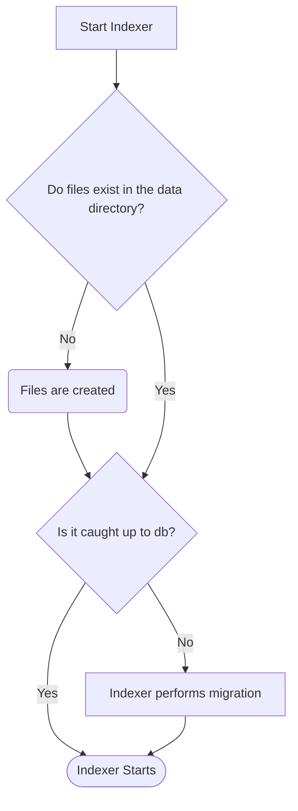

# Local Ledger

In order to ensure that various operations are performed in a timely manner, the Indexer stores a "local ledger" in the supplied data directory.  This ledger allows for fast lookup of data and significantly reduces the amount of time to perform initial loading of the state data. In previous versions of indexer the database was queried to fetch this data.

In case of upgrading from an earlier version of Indexer, or setting up a new Indexer server with an existing database, the local ledger must sometimes be initialized when the Indexer is started.  A simplified flow is shown below:

Initialization can be performed in a couple of ways:

1) The Indexer can be told to use a catchpoint to "fast-forward" through the process.
2) The Indexer can use a "sequential scan" of the database and insert data into the ledger one by one.

By default, the Indexer will choose option 2 unless otherwise specified.

