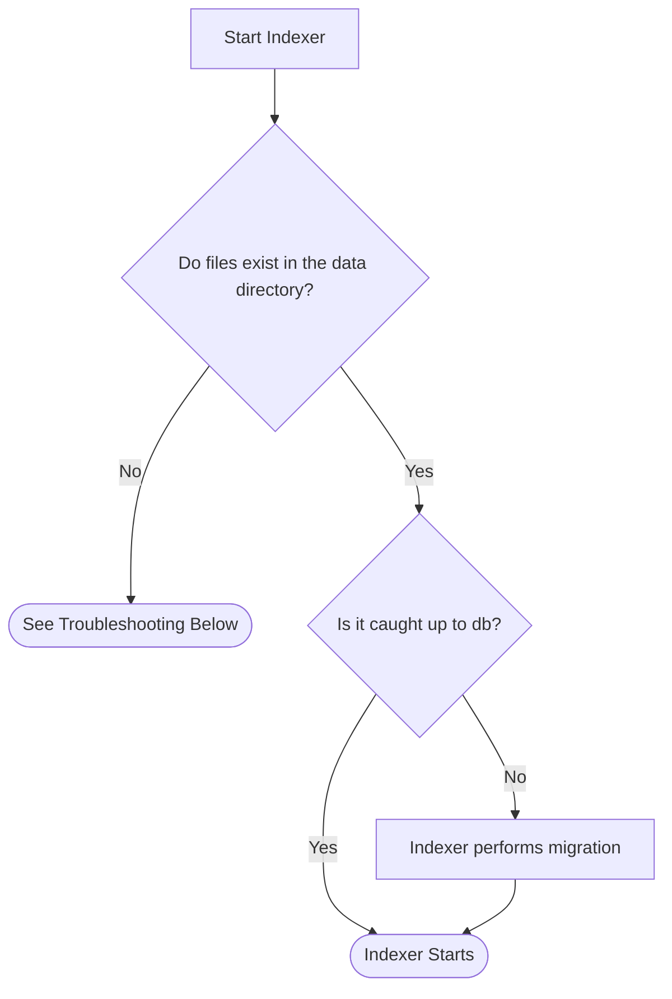

# Local Ledger

In order to ensure that various operations are performed in a timely manner, the Indexer stores a "local ledger" in the supplied data directory.  This ledger allows for fast lookup of data and significantly reduces the amount of time to perform initial loading of the state data.

To maintain backwards compatability with the current Indexer API, the Indexer also maintains a database backend that is used to service the REST API.  Because of this, the local ledger must have data "migrated" to it whenever the Indexer is started.  A simplified flow is shown below:

Migration can be performed in a couple of ways:

1) The Indexer can be told to use a catchpoint to "fast-forward" through the process.
2) The Indexer can use a "sequential scan" of the database and insert data into the ledger one by one.

By default, the Indexer will choose option 2 unless otherwise specified.

## Troubleshooting

In the flowchart shown above, it is seen that if the necessary local ledger files do not exist in the data directory an error will be printed and the Indexer will not start.

To resolve this, one can perform any of the following:

1) Perform a sequential migration.  This option is the most secure but takes the longest.
2) Initialize the files with a catchpoint.  This option is faster than a sequential migraiton but relies on trusting the provider of the catchpoint.
3) Copy the local ledger files from an existing node installation into the data directory.

