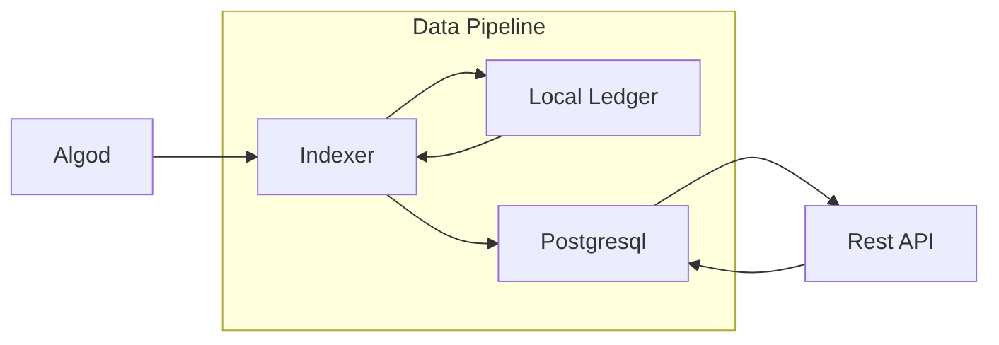
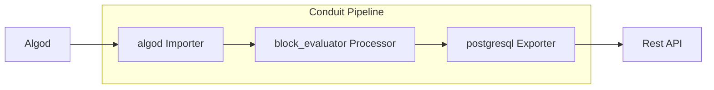
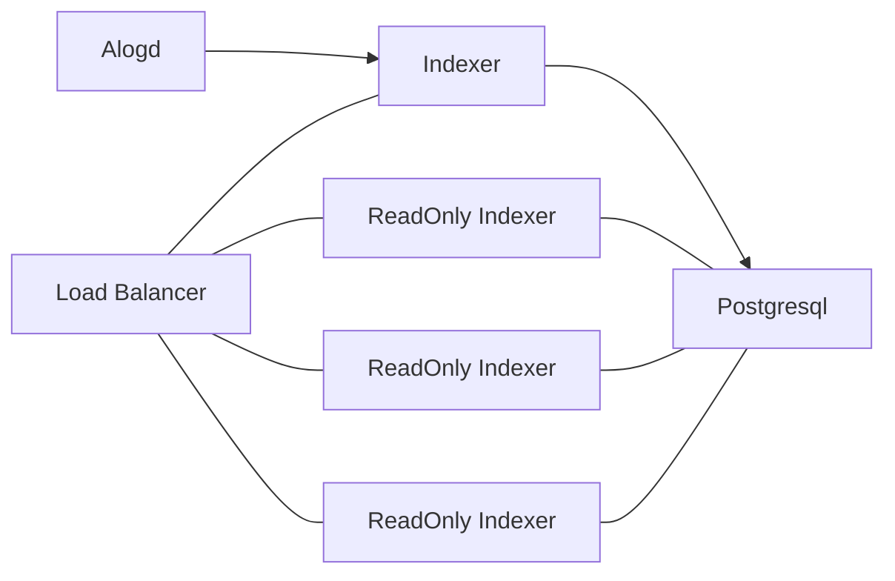
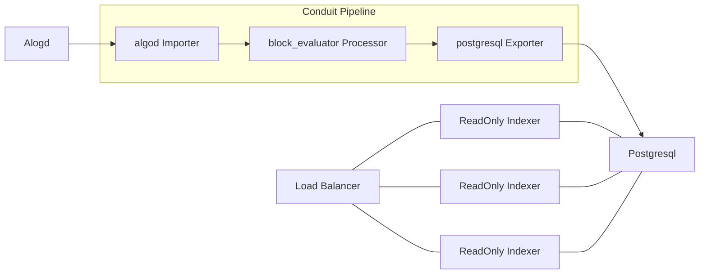

## Migrating from Indexer to Conduit

The [Algorand Indexer](https://github.com/algorand/indexer) provides both a block processing pipeline to ingest block
data from an Algorand node into a Postgresql database, and a rest API which serves that data.

The [Conduit](https://github.com/algorand/indexer/blob/develop/docs/Conduit.md) project provides a modular pipeline
system allowing users to construct block processing pipelines for a variety of use cases as opposed to the single,
bespoke Indexer construction.

### Migration
Talking about a migration from Indexer to Conduit is in some ways difficult because they only have partial overlap in
their applications. For example, Conduit does _not_ currently include a rest API either for checking pipeline health
or for serving data from the pipeline. 

Here is the Indexer architecture diagram at a high level. The raw block data is enriched by the account data retrieved
from the local ledger, and everything is written to Postgresql which can then be queried via the API.

However, Conduit was built to generalize and modularize a lot of the tasks which Indexer does when ingesting block data
into its database. For that reason you can swap out the core data pipeline in Indexer with an equivalent Conduit
pipeline--and that's just what we've done!

Using the most recent release of Indexer will create a Conduit pipeline config and launch the pipeline to ingest the
data used to serve the rest API. Take a look
[here](https://github.com/algorand/indexer/blob/develop/cmd/algorand-indexer/daemon.go#L359) if you're interested in
seeing the exact config used in Indexer.

### Adopting Conduit features in your Indexer pipeline

Since Indexer is now using Conduit for its data pipeline, it will benefit from the continued development of the specific
plugins being used. However, we don't plan on exposing the full set of Conduit features through Indexer. In order to
start using new features, or new plugins to customize, filter, or further enrich the block data, or even change the
type of DB used in the backed, you will need to separate Indexer's data pipeline into your own custom Conduit pipeline.

A common deployment of the Indexer might look something like this.

Because the database connection can only tolerate a single writer without having race conditions and/or deadlocks,
Indexer offers a read-only mode which does not run the data pipeline and has no write access to the database. It's
common to use the read only mode to scale out the rest API--running multiple web servers behind a load balancer as is
shown in the diagram.

Separating the data pipeline from the Indexer when using this setup is simple--take Indexer's Conduit config
[shown earlier there](https://github.com/algorand/indexer/blob/develop/cmd/algorand-indexer/daemon.go#L359), write it
to a file, and launch the Conduit binary. Take a look at the [getting started guide](../GettingStarted.md) for more
information on installing and running Conduit.

We still plan on supporting the Indexer API alongside Conduit--that means that any changes made to the Postgresql plugin
will either be backwards compatible with the Indexer API, ando/or have corresponding fixes in Indexer.

Here is our architecture diagram with Conduit as our data pipeline.

With this architecture you're free to do things like use filter processors to limit the size of your database--though
doing this will affect how some Indexer APIs function.