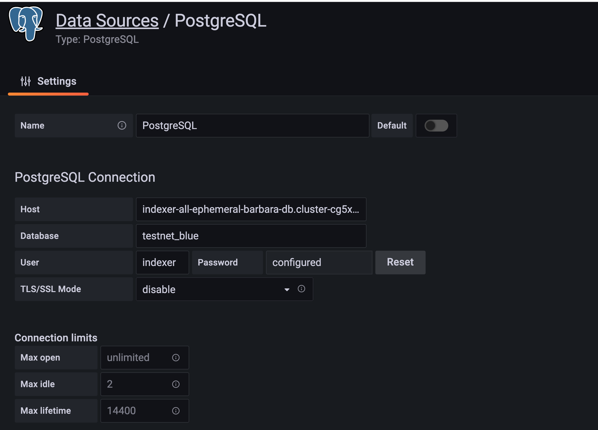

## Indexer Monitoring Dashboard
A monitoring dashboard displaying indexer performance metrics. 

### To start a monitoring dashboard
Configurable env vars, `DB_CONNECTION`, `ALGOD_NET` and `ALGOD_TOKEN`. The defaults are set in `.env`. User must provide a valid `ALGOD_NET` and `ALGOD_TOKEN` pair.

if indexer is not already running, start all services in `docker-compose.yml`

`docker-compose up -d`

if indexer is already running, start monitoring services only.

`docker-compose up -d prometheus grafana`
 
prometheus target should be updated to listen to a correct indexer address (host:port), 

```json
static_configs:
- targets: ['indexer:8888'] 
```

By default, 
 - indexer is running on http://localhost:8888 
 - grafana is running on http://localhost:3000; default login (admin/admin)

### View metrics on grafana

- In grafana configurations, add a PostgreSQL datasource. See example below. 
- Go to Import and upload dashboard.json
- Run `create extension pg_stat_statements;` sql on db to enable query stats from Postgres




**Default widgets**:

Importing
- Block import time
- Transactions per block by type
- TPS
- Round #

Query

- Request duration
- Request duraton by url
- Postgres Eval Time

System

- average CPU usage
- average Heap Alloc
- Postgres table info
- Postgres queries info


