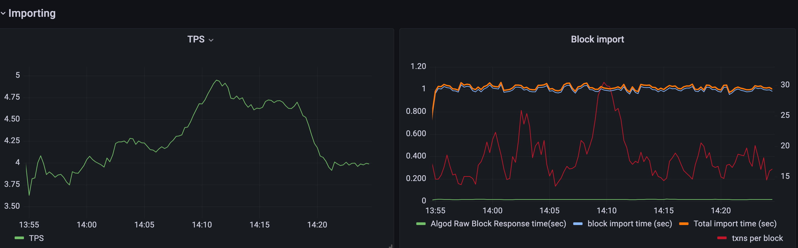

## Indexer Monitoring Dashboard
A monitoring dashboard displaying indexer performance metrics. 

### To start a monitoring dashboard
### Prerequisite
 - Algorand indexer is running with metrics-mode set to ON or VERBOSE 

Data sources for Grafana are set in `grafana_prometheus_datasource.yml`. Check that configurations for
Prometheus source and PostgresSQL source are correct or Grafana will not have the metrics.

Also, Prometheus target should be updated to listen to a correct indexer address (host:port). The default target assumes
the indexer is running on prometheus container's host at port 8888. Check `<prometheus-url>/targets` to see whether Prometheus
connects to the target successfully. 

```json
static_configs:
- targets: ['host.docker.internal:8888'] 
```

Run,

`docker-compose up -d prometheus grafana` 

- Check metrics are written to <indexer-url>/metrics 
- Grafana is running on http://localhost:3000; default login (admin/admin)


### View metrics on grafana

- Go to Import and upload dashboard.json
- Run `create extension pg_stat_statements;` sql on db to enable query stats from Postgres




**Default widgets**:

Importing
- Block import time
- Transactions per block by type
- TPS
- Round #

Query

- Request duration
- Request duraton by url
- Postgres Eval Time

System

- average CPU usage
- average Heap Alloc
- Postgres table info
- Postgres queries info


